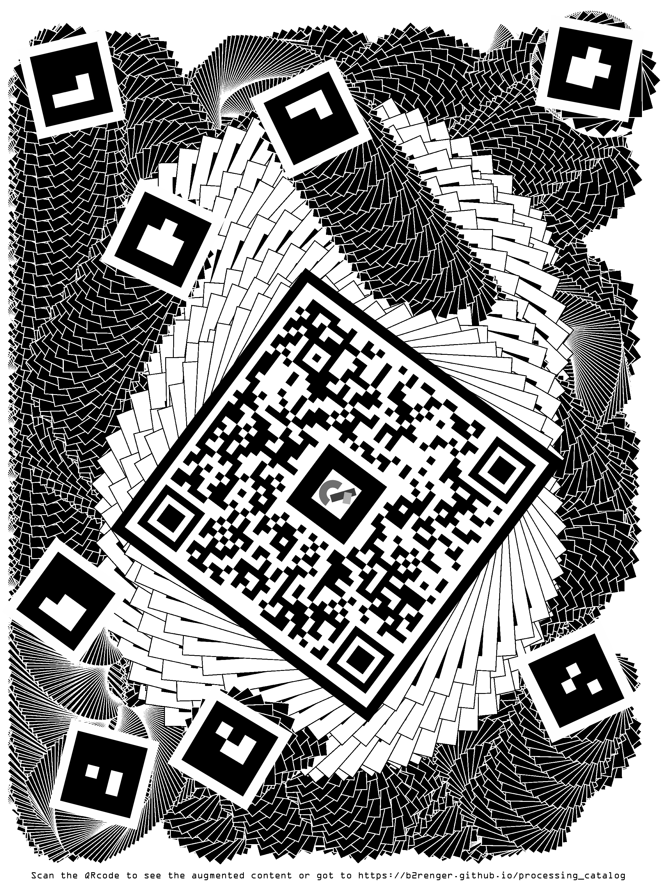

# processing_catalog
Contribution to processing catalog :
https://twitter.com/ProcessingOrg/status/1439283507679797160

You can find the sketch made to create the image below. This image serves as a qr code and a series of markers to display content in AR using AFrame and Arjs. Content is created through p5js sketches which are then mapped as textures on 3D objects or planes.

So scan this image or go to ()[https://b2renger.github.io/processing_catalog]